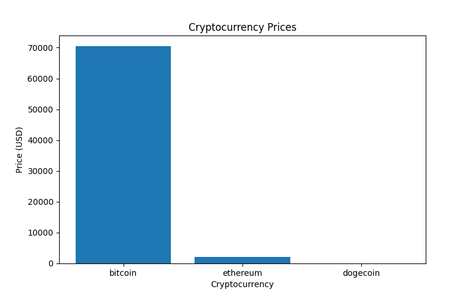

🚀 Crypto Data Pipeline

Crypto Data Pipeline is an end-to-end Python project that automatically fetches, processes, stores, analyzes, and visualizes cryptocurrency market data. This project demonstrates real-world data engineering, Python automation, and data visualization skills — perfect for Data Engineer or Python AI roles.

🛠️ Features

Automated Data Fetching – Retrieve real-time cryptocurrency data from APIs

Data Cleaning & Processing – Transform raw data into structured, analyzable formats

Storage Options – Save processed data in CSV, JSON, and SQLite database

Analysis – Explore trends, calculate metrics, and detect patterns

Visualization – Generate charts to easily interpret crypto market data

Pipeline Automation – Full workflow runs with minimal manual intervention
crypto-data-pipeline/
│
├── fetch_data.py
├── process_data.py
├── store_data.py
├── analyze_data.py
│
├── crypto_data.json
├── processed_crypto_data.csv
├── crypto_prices.db
│
├── chart.png
└── README.md
📊 Example Output

  

Figure: Automatically generated cryptocurrency price trends from the pipeline.

⚡ Technologies Used

Python – Core scripting and automation language

Pandas – Data manipulation and cleaning

SQLite – Database storage for structured data

Matplotlib / Seaborn – Visualization of market trends

APIs – Fetch live cryptocurrency data

🎯 Learning Outcomes

Build end-to-end data pipelines

Handle real-world data formats (CSV, JSON, SQL)

Automate workflows with Python scripts

Perform analysis and visualization for insights

Apply skills relevant to Data Engineer, Python Developer, or AI Engineer roles
git clone https://github.com/webdomain0126/crypto-data-pipeline.git
cd crypto-data-pipeline
pip install -r requirements.txt
python fetch_data.py
python process_data.py
python store_data.py
python analyze_data.py
Check outputs:

processed_crypto_data.csv

crypto_prices.db

chart.png

👩‍💻 About Me

I’m Tisa Akhter, a Python & Data Engineering enthusiast. This project demonstrates my ability to build automated, end-to-end data pipelines, perform analysis, and create visualizations that are immediately actionable — skills highly relevant for remote Data Engineer / Python AI roles.
